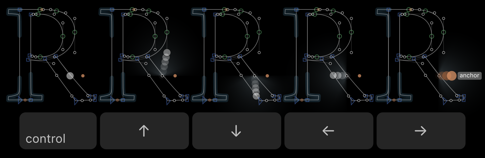
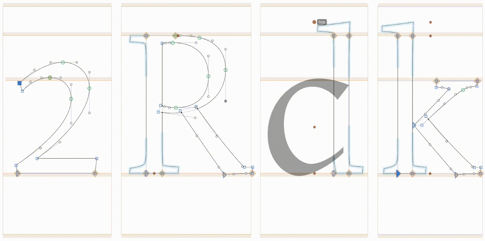

# Keyboard Selection Travel

This is a plugin for the [Glyphs font editor](https://glyphsapp.com).
Move the selection visually.



## Installation

[Install **Keyboard Selection Travel** in Glyphs](https://florianpircher.com/glyphs/plugins/guten-tag/install)

Install the plugin using the link above or search for “Keyboard Selection Travel” in the Plugin Manager.
Relaunch Glyphs for the plugin to be loaded.

## Usage

Hold down the Control key on your keyboard and press an arrow key.
If you press Up, Keyboard Selection Travel searches for the closest point above the selected point.
If there is such a point, it is selected; otherwise, the selection does not change.
The same goes for moving the selection downwards, to the right, or the left.

Keyboard Selection Travel can select on-curve points, off-curve points, and anchors.

If multiple points are selected, Keyboard Selection Travel will move all selections independently.

## Troubleshooting

Make sure to restart Glyphs after installing Keyboard Selection Travel for the plugin to be loaded.

In some cases pressing the arrow keys while holding down Control might still not work. This is bacause the Control-Up/Down/Left/Right shortcuts are used by the system (typically to move to a different space or to activate Mission Control) or by some other app.

To fix this, deactivate the other shortcuts. If you want to keep them, you can also change the Keyboard Selection Travel shortcuts to Control-**Shift**-Up/Down/Left/Right by enabeling the `UseAlternativeShortcuts` preference.

<details>
<summary>Set Preferences from the Command Line</summary>

Run the following line to set the preference to `YES` (or `NO` to deactivate).

```
defaults write com.GeorgSeifert.Glyphs3 com.FlorianPircher.Keyboard-Selection-Travel.UseAlternativeShortcuts YES
```
</details>

<details>
<summary>Set Preferences from Glyphs’ Macro Panel</summary>

Run the following line to set the preference to `True` (or `False` to deactivate).

```
Glyphs.boolDefaults["com.FlorianPircher.Keyboard-Selection-Travel.UseAlternativeShortcuts"] = True
```
</details>

<details>
<summary>Set Preferences using mekkablue’s scripts</summary>

Select *Script* → *mekkablue* → *App* → *Set Hidden App Preferences*. Enter `com.FlorianPircher.Keyboard-Selection-Travel.UseAlternativeShortcuts`), set the value to `YES` (or `NO` to deactivate), and confirm with *Apply*.
</details>

## How does it work?

Keyboard Selection Travel evaluates all unselected points according to a distance function.
Each point is assigned a distance to the currently selected point.
The point with the smallest distance is selected.



Let’s say you have one point selected and press Control-Up.
This action moves the selection to the closest points above the current selection.
The closest point is determined by assigning each unselected point a distance and picking the point with the smallest distance.

The distance between two points can be computed in many different ways.
The rectilinear distance is the sum of the vertical offset and the horizontal offset (`|p1.x - p2.x| + |p1.y - p2.y|`).
The Euclidean distance is the length of a straight line from one point to the other (`sqrt((p1.x - p2.x)^2 + (p1.y - p2.y)^2)`).
Both distances are unsuitable since they do not distinguish between vertical offset and horizontal offset.

In the animation above, observe the moving selection on the digit 2 on the left.
When it jumps up (Control-Up) from the base to the terminal at the top, the selection does not move to any handle from the base, even though those all have a smaller rectilinear distance and Euclidean distance than the point at the end of the terminal.
For this to work, the distance function must treat the vertical offset of points differently from their horizontal offset.

The distance function used by this plugin can be visualized like so:


This is the visualization for left-right movement; up-down movement would look the same but rotated by 90 degrees.
The currently selected node is placed in the center.
All other points are evaluated with respect to this center.
Closer points are brighter; points further aways are drawn darker.

As you can see, points on the same hight as the selected point are particularly bright.
Still, the brightness tapers off into the distance, giving closer points with a bit more deviation from the main axis a chance.

Such a distance function can never be perfect, and I will happily engage in proposals for better distance functions.
The function shown above works sufficiently well, at least in my testing.

## Licenses

Licensed under the [Apache License, Version 2.0](http://www.apache.org/licenses/LICENSE-2.0).
