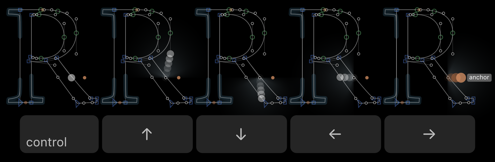

# Keyboard Selection Travel

This is a plugin for the [Glyphs font editor](https://glyphsapp.com).
Move the selection visually.



## Installation

[Install **Keyboard Selection Travel** in Glyphs](https://florianpircher.com/glyphs/plugins/keyboard-selection-travel/install)

Install the plugin using the link above or search for “Keyboard Selection Travel” in the Plugin Manager.
Relaunch Glyphs for the plugin to be loaded.

## Usage

[](https://florianpircher.com/glyphs/plugins/keyboard-selection-travel/video/animation.mp4)

1. In Edit view, select a point (on-curve point /, off-curve point , or anchor ) and hold down the Control key.
2. Keyboard Selection Travel marks all available travel destinations with a small gray triangle (▲&#xFE0E;, ▼&#xFE0E;, ◀&#xFE0E;, or ▶&#xFE0E;).
3. Press the Up ▲&#xFE0E; arrow key while still holding the Control key to move the selection to the point marked with the up triangle ▲&#xFE0E;.

The same goes for the Down ▼&#xFE0E;, Left ◀&#xFE0E;, and Right ▶&#xFE0E; arrow keys.

If you don’t like any of the marked travel destinations, press the Command key (while still holding down Control). The next closest travel destinations will be marked with gray triangles. Release the Command key and press one of the arrow keys to travel the selection to that destination.

If multiple points are selected, Keyboard Selection Travel will move all selections independently.

## Preferences

Keyboard Selection Travel offers a range of configurable preferences.

### Show Hints

The `ShowHints` preference controls whether travel hints (small arrow-head icons) are shown when holding down the Control key.
This preference is activated by default.

<details>
<summary>Setting the <code>ShowHints</code> Preference</summary>

<details>
<summary>Set <code>ShowHints</code> from the Command Line</summary>

Run the following line to set the preference to `NO` (or `YES` to activate):

```shell
defaults write com.GeorgSeifert.Glyphs3 com.FlorianPircher.Keyboard-Selection-Travel.ShowHints -bool NO
```

Run the following line to use the default value:

```shell
defaults delete com.GeorgSeifert.Glyphs3 com.FlorianPircher.Keyboard-Selection-Travel.ShowHints
```
</details>

<details>
<summary>Set <code>ShowHints</code> from Glyphs’ Macro Panel</summary>

Run the following line to set the preference to `False` (or `True` to activate, or `None` to reset):

```python
Glyphs.boolDefaults["com.FlorianPircher.Keyboard-Selection-Travel.ShowHints"] = False
```
</details>

<details>
<summary>Set <code>ShowHints</code> using mekkablue’s scripts</summary>

Choose *Script* → *mekkablue* → *App* → *Set Hidden App Preferences*, enter `com.FlorianPircher.Keyboard-Selection-Travel.ShowHints`), set the value to `NO` (or `YES` to activate), and confirm with *Apply*.
Click *Reset* to use the default value.
</details>
</details>

### Hint Size

The `HintSize` preference controls the visual size of travel hints.
Set the preference to `-1` for automatic size (default), `0` for small, `1` for regular, or `2` for large.

<details>
<summary>Setting the <code>HintSize</code> Preference</summary>

<details>
<summary>Set <code>HintSize</code> from the Command Line</summary>

Run the following line to set the preference to `-1`, `0`, `1`, or `2`:

```shell
defaults write com.GeorgSeifert.Glyphs3 com.FlorianPircher.Keyboard-Selection-Travel.HintSize -int 2
```

Run the following line to use the default value:

```shell
defaults delete com.GeorgSeifert.Glyphs3 com.FlorianPircher.Keyboard-Selection-Travel.HintSize
```
</details>

<details>
<summary>Set <code>HintSize</code> from Glyphs’ Macro Panel</summary>

Run the following line to set the preference to `-1`, `0`, `1`, or `2` (or `None` to reset):

```python
Glyphs.defaults["com.FlorianPircher.Keyboard-Selection-Travel.HintSize"] = 2
```
</details>

<details>
<summary>Set <code>HintSize</code> using mekkablue’s scripts</summary>

Choose *Script* → *mekkablue* → *App* → *Set Hidden App Preferences*, enter `com.FlorianPircher.Keyboard-Selection-Travel.HintSize`), set the value to `-1`, `0`, `1`, or `2`, and confirm with *Apply*.
Click *Reset* to use the default value.
</details>
</details>

### Hint Color

The `HintColor` preference controls the color of travel hints.
Set the preference to `10` for the default gray color or to one of the following numbers:
`0`: red, `1`: orange, `2`: brown, `3`: yellow, `4`: green, `7`: blue, `8`: purple, `9`: pink, `10`: gray.

<details>
<summary>Setting the <code>HintColor</code> Preference</summary>

<details>
<summary>Set <code>HintColor</code> from the Command Line</summary>

Run the following line to set the preference:

```shell
defaults write com.GeorgSeifert.Glyphs3 com.FlorianPircher.Keyboard-Selection-Travel.HintColor -int 1
```

Run the following line to use the default value:

```shell
defaults delete com.GeorgSeifert.Glyphs3 com.FlorianPircher.Keyboard-Selection-Travel.HintColor
```
</details>

<details>
<summary>Set <code>HintColor</code> from Glyphs’ Macro Panel</summary>

Run the following line to set the preference (or set it to `None` to reset it):

```python
Glyphs.defaults["com.FlorianPircher.Keyboard-Selection-Travel.HintColor"] = 1
```
</details>

<details>
<summary>Set <code>HintColor</code> using mekkablue’s scripts</summary>

Choose *Script* → *mekkablue* → *App* → *Set Hidden App Preferences*, enter `com.FlorianPircher.Keyboard-Selection-Travel.HintColor`), set the value, and confirm with *Apply*.
Click *Reset* to use the default value.
</details>
</details>

### Ignore Anchors

The `IgnoreAnchors` preference excludes anchors from the travel destinations.
This preference is deactivated by default.

<details>
<summary>Setting the <code>IgnoreAnchors</code> Preference</summary>

<details>
<summary>Set <code>IgnoreAnchors</code> from the Command Line</summary>

Run the following line to set the preference to `YES` (or `NO` to deactivate):

```shell
defaults write com.GeorgSeifert.Glyphs3 com.FlorianPircher.Keyboard-Selection-Travel.IgnoreAnchors -bool YES
```

Run the following line to use the default value:

```shell
defaults delete com.GeorgSeifert.Glyphs3 com.FlorianPircher.Keyboard-Selection-Travel.IgnoreAnchors
```
</details>

<details>
<summary>Set <code>IgnoreAnchors</code> from Glyphs’ Macro Panel</summary>

Run the following line to set the preference to `True` (or `False` to deactivate, or `None` to reset):

```python
Glyphs.boolDefaults["com.FlorianPircher.Keyboard-Selection-Travel.IgnoreAnchors"] = True
```
</details>

<details>
<summary>Set <code>IgnoreAnchors</code> using mekkablue’s scripts</summary>

Choose *Script* → *mekkablue* → *App* → *Set Hidden App Preferences*, enter `com.FlorianPircher.Keyboard-Selection-Travel.IgnoreAnchors`), set the value to `YES` (or `NO` to deactivate), and confirm with *Apply*.
Click *Reset* to use the default value.
</details>
</details>

### Ignore Tools

The `IgnoreTools` preference defines a list of tools for which the plugin should be disabled.
This list stores the class names of the tools for which Keyboard Selection Travel should be disabled.
The default values list contains the two entries `GlyphsToolText` and `GlyphsToolHand` (the Text and Hand tool).
Run the following code in the Macro Panel to get the class name of the currently active tool:

```python
print(Glyphs.documents[0].windowController().toolDrawDelegate().className())
```

<details>
<summary>Setting the <code>IgnoreTools</code> Preference</summary>

<details>
<summary>Set <code>IgnoreTools</code> from the Command Line</summary>

Run the following line to set the preference:

```shell
defaults write com.GeorgSeifert.Glyphs3 com.FlorianPircher.Keyboard-Selection-Travel.IgnoreTools -array GlyphsToolText GlyphsToolTrueTypeInstructor
```

Run the following line to use the default value:

```shell
defaults delete com.GeorgSeifert.Glyphs3 com.FlorianPircher.Keyboard-Selection-Travel.IgnoreTools
```
</details>

<details>
<summary>Set <code>IgnoreTools</code> from Glyphs’ Macro Panel</summary>

Run the following line to set the preference (or set to `None` to reset it):

```python
Glyphs.defaults["com.FlorianPircher.Keyboard-Selection-Travel.IgnoreTools"] = ["GlyphsToolText", "GlyphsToolTrueTypeInstructor"]
```
</details>
</details>

### Use Alternative Shortcuts

The `UseAlternativeShortcuts` preference accepts shortcuts with only the Control key or with Control and Shift held simultaneously.
This is helpful in case Command-Arrow key is already used by some other command (another plugin, some script, a macOS system command, etc.).
This preference is deactivated by default.

<details>
<summary>Setting the <code>UseAlternativeShortcuts</code> Preference</summary>

<details>
<summary>Set <code>UseAlternativeShortcuts</code> from the Command Line</summary>

Run the following line to set the preference to `YES` (or `NO` to deactivate):

```shell
defaults write com.GeorgSeifert.Glyphs3 com.FlorianPircher.Keyboard-Selection-Travel.UseAlternativeShortcuts -bool YES
```

Run the following line to use the default value:

```shell
defaults delete com.GeorgSeifert.Glyphs3 com.FlorianPircher.Keyboard-Selection-Travel.UseAlternativeShortcuts
```
</details>

<details>
<summary>Set <code>UseAlternativeShortcuts</code> from Glyphs’ Macro Panel</summary>

Run the following line to set the preference to `True` (or `False` to deactivate, or `None` to reset):

```python
Glyphs.boolDefaults["com.FlorianPircher.Keyboard-Selection-Travel.UseAlternativeShortcuts"] = True
```
</details>

<details>
<summary>Set <code>UseAlternativeShortcuts</code> using mekkablue’s scripts</summary>

Choose *Script* → *mekkablue* → *App* → *Set Hidden App Preferences*, enter `com.FlorianPircher.Keyboard-Selection-Travel.UseAlternativeShortcuts`), set the value to `YES` (or `NO` to deactivate), and confirm with *Apply*.
Click *Reset* to use the default value.
</details>
</details>

## Troubleshooting

Make sure to restart Glyphs after installing Keyboard Selection Travel for the plugin to be loaded.

In some cases pressing the arrow keys while holding down Control might still not work.
This is because the Control-Up/Down/Left/Right shortcuts are used by the system (typically to move to a different space or to activate Mission Control) or by some other app.

Fix these issue by disabling the other shortcuts.
If you want to keep them, you can also change the Keyboard Selection Travel shortcuts to Control-**Shift**-Up/Down/Left/Right by enabling the `UseAlternativeShortcuts` preference (see the section above for details).

## How does it work?

Keyboard Selection Travel evaluates all unselected points according to a distance function.
Each point is assigned a distance to the currently selected point.
The point with the smallest distance is selected.

Let’s say you have one point selected and press Control-Up.
This action moves the selection to the closest points above the current selection.
The closest point is determined by assigning each unselected point a distance and picking the point with the smallest distance.

The distance between two points can be computed in many different ways.
The rectilinear distance is the sum of the vertical offset and the horizontal offset (`|p1.x - p2.x| + |p1.y - p2.y|`).
The Euclidean distance is the length of a straight line from one point to the other (`sqrt((p1.x - p2.x)^2 + (p1.y - p2.y)^2)`).
Both distances are unsuitable since they do not distinguish between vertical offset and horizontal offset.

In the animation above, observe the moving selection on the digit 2 on the left.
When it jumps up (Control-Up) from the base to the terminal at the top, the selection does not move to any handle from the base, even though those all have a smaller rectilinear distance and Euclidean distance than the point at the end of the terminal.
For this to work, the distance function must treat the vertical offset of points differently from their horizontal offset.

The distance function used by this plugin can be visualized like so:


This is the visualization for left-right movement; up-down movement would look the same but rotated by 90 degrees.
The currently selected node is placed in the center.
All other points are evaluated with respect to this center.
Closer points are brighter; points further aways are drawn darker.

As you can see, points of the same height as the selected point are particularly bright.
Still, the brightness tapers off into the distance, giving closer points with a bit more deviation from the main axis a chance.

Such a distance function can never be perfect, and I will happily engage in proposals for better distance functions.
The function shown above works sufficiently well, at least in my testing.

## Licenses

Licensed under the [Apache License, Version 2.0](http://www.apache.org/licenses/LICENSE-2.0).
